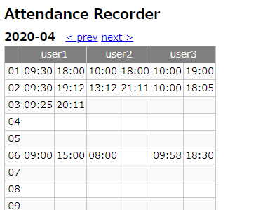

# attendance-recorder

出退勤を記録するアプリケーションです。

## 出退勤の登録

APIで出退勤の情報を登録します。

```
POST http://localhost:8080/api/attendances
```
```json
{
    "userName" : "user1",
    "type" : "COME"
}
```

* `userName` : ユーザ名です。
* `type` : 出退勤の種別です。出勤時は`COME`、退勤時は`LEAVE`を指定します。

## 出退勤の参照

画面として出退勤を参照できます。

* http://localhost:8080/

