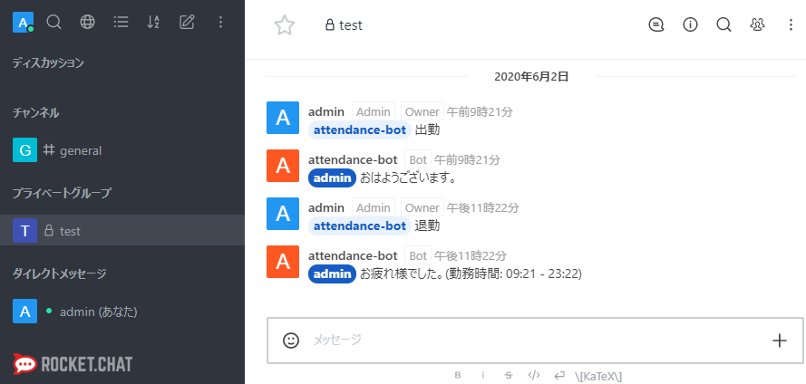

# attendance-recorder

出退勤を記録するアプリケーションです。

## 実行方法

実行にはJava(JDK8以上)が必要となります。

下記から最新の実行ファイル(attendance-recorder-x.x.x.jar)を入手します。

* https://github.com/onozaty/attendance-recorder/releases/latest

入手したjarファイルを指定してアプリケーションを実行します。

```
java -jar attendance-recorder-1.0.0.jar
```

実行ディレクトリに配下に`h2db`というディレクトリが作成されます。このディレクトリにデータが格納されますので、削除しないようにご注意ください。


## 出退勤の登録

APIで出退勤の情報を登録します。

```
POST http://localhost:8080/api/attendances
```
```json
{
    "userName" : "user1",
    "type" : "COME"
}
```

* `userName` : ユーザ名です。
* `type` : 出退勤の種別です。出勤時は`COME`、退勤時は`LEAVE`を指定します。

## 出退勤の参照

画面として出退勤を参照できます。

* http://localhost:8080/


## Rocket.Chatとの連携

Rocket.ChatのOutgoing WebHookを利用することで、Rocket.Chatと簡単に連携できます。

Outgoing WebHook の設定にて下記のように設定します。

* イベントトリガー : `メッセージが送信されました`
* URLs : `http://attendance-recorder:8080/api/chat/handle` ※attendance-recorderを実行しているサーバのIP、ドメイン等に置き換えてください。
* 投稿ユーザ : `attendance-bot` ※他の名前を利用する場合は、アプリケーション側の設定を変更する必要があります。

botに対して`出勤`、`退勤`とメッセージを送ることで、出退勤を記憶してくれます。



## 設定ファイル

各種設定は、下記のファイルで定義されています。(Spring Bootの設定ファイル)

* https://github.com/onozaty/attendance-recorder/blob/master/src/main/resources/application.yml

```yaml
spring:
  datasource: 
    url: jdbc:h2:./h2db/db
application:
  chat:
    bot-name: attendance-bot
    come-phrase: 出勤
    leave-phrase: 退勤
    come-response-message: おはようございます。
    leave-response-message: 'お疲れ様でした。(勤務時間: %s - %s)'
```

Rocket.Chatとの連携時の動きを変えたい場合には、`application.chat` 配下の各種設定を変更することで対応できます。

* `application.chat.bot-name` : Rocket.Chat上のbotの名前です。Rocket.Chat側のOutgoing WebHookで設定した投稿ユーザと同じ名前にしてください。
* `application.chat.come-phrase` : 出勤として扱う単語です。この単語が含まれるメッセージを受け取った際に、出勤を記録します。
* `application.chat.leave-phrase` : 退勤として扱う単語です。この単語が含まれるメッセージを受け取った際に、退勤を記録します。
* `application.come-response-message` : 出勤時にbotが返すメッセージです。
* `application.chat.leave-response-message` : 退勤時にbotが返すメッセージです。1番目の`%s`は出勤時間、2番目の`%s`は退勤時間に置換されます。

変更した`application.yml`を実行ディレクトリに配置して実行すると、変更した`application.yml`の内容で起動できます。

